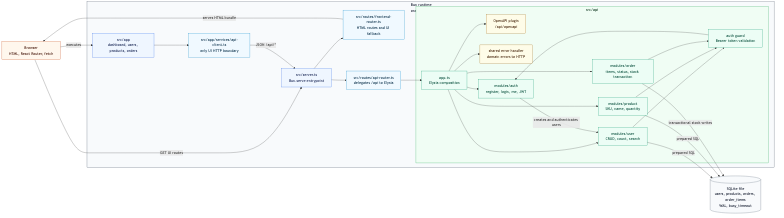

# Diagrama C4 Container



- Fonte editavel: [`c4-container.mmd`](c4-container.mmd)
- Export SVG: [`exports/c4-container.svg`](exports/c4-container.svg)
- Export PNG: [`exports/c4-container.png`](exports/c4-container.png)

## 1. Resumo Executivo

Este diagrama detalha os containers internos da aplicacao. O sistema roda em um
unico processo Bun, mas ainda preserva boundaries claros: servidor HTTP, rotas de
frontend, delegacao `/api`, UI React, API Elysia, modulos MVC, auth guard, error
handler, OpenAPI e SQLite.

O ponto arquitetural mais importante e que "runtime unico" nao significa
"camadas misturadas". A UI consome HTTP, a API concentra regra de negocio e o
SQLite fica isolado em repositories.

## 2. Analise Tecnica

### Containers e responsabilidades

- `Browser`: carrega HTML, executa React Router e faz `fetch`.
- `src/server.ts`: entrypoint `Bun.serve` para desenvolvimento e binario.
- `src/routes/frontend-router.ts`: entrega HTML e fallback da UI.
- `src/routes/api-router.ts`: delega `/api/*` para a aplicacao Elysia.
- `src/app`: UI React com dashboard, usuarios, produtos e pedidos.
- `src/app/services/api-client.ts`: unico boundary HTTP do frontend.
- `src/api/app.ts`: composicao Elysia da API.
- `OpenAPI plugin`: publica `/api/openapi` e `/api/openapi/json`.
- `shared error handler`: converte erros conhecidos para HTTP estavel.
- `modules/auth`: registro, login, `/me` e JWT.
- `modules/user`: CRUD, listagem, contagem e busca.
- `modules/product`: catalogo, SKU e estoque.
- `modules/order`: itens, status e transacao de estoque.
- `auth guard`: transforma Bearer token em usuario autenticado.
- `SQLite file`: estado persistente com WAL e `busy_timeout`.

### Fluxo de frontend

1. Browser faz `GET` em uma rota da UI.
2. `src/server.ts` chama `frontend-router.ts`.
3. O HTML inicial carrega a aplicacao React.
4. React Router resolve a tela.
5. A tela chama `api-client.ts`.
6. `api-client.ts` chama `/api/*` com JSON e token quando necessario.

Esse fluxo impede que componentes acessem `fetch`, token ou contrato HTTP de
forma espalhada. O custo de manutencao fica concentrado no API client.

### Fluxo de backend

1. `src/server.ts` recebe `/api/*`.
2. `api-router.ts` encaminha a request para Elysia.
3. `src/api/app.ts` aplica plugins, rotas, auth e error handling.
4. O modulo de dominio valida entrada com Zod.
5. Controller chama service.
6. Service aplica regra de negocio.
7. Repository executa SQL preparado e retorna modelo/DTO seguro.

### Performance e latencia

A ausencia de proxy interno reduz latencia de desenvolvimento e entrega local.
O caminho HTTP e curto, e cada modulo evita reflection pesada ou ORM. O uso de
prepared statements reduz custo por request em queries repetidas.

No frontend, centralizar chamadas em `api-client.ts` evita duplicacao de parsing
e de tratamento de erro. Isso reduz risco de payload excessivo ou retry
inconsistente em telas diferentes.

### Concorrencia e throughput

O processo HTTP pode atender multiplas requests, mas as escritas SQLite seguem o
modelo single-writer. Por isso `orderModule` precisa manter transacoes curtas ao
criar/cancelar pedido e alterar estoque.

Controllers e services nao guardam estado entre requests, entao nao criam
contencao adicional em memoria. A contencao relevante fica no banco e nas
transacoes de estoque.

### Falhas e resiliencia

Falhas de entrada sao barradas por schemas. Falhas de autorizacao passam pelo
auth guard. Falhas de dominio sao levantadas em services/repositories e
normalizadas pelo error handler.

Como OpenAPI e gerado no mesmo processo, o contrato publicado tende a acompanhar
rotas e schemas. Mesmo assim, mudancas de API precisam atualizar `docs/api.md` e
testes HTTP para evitar drift documental.

## 3. Implementacao

Arquivos relacionados:

- Fonte Mermaid: `docs/diagrams/c4-container.mmd`.
- Draw.io editavel: `docs/diagrams/drawio/c4-container.drawio`.
- PNG usado no README: `docs/diagrams/exports/c4-container.png`.
- SVG para zoom: `docs/diagrams/exports/c4-container.svg`.

Comando para regenerar o PNG:

```bash
npx --yes @mermaid-js/mermaid-cli@11.12.0 \
  -i docs/diagrams/c4-container.mmd \
  -o docs/diagrams/exports/c4-container.png
```

Comando para regenerar o SVG:

```bash
npx --yes @mermaid-js/mermaid-cli@11.12.0 \
  -i docs/diagrams/c4-container.mmd \
  -o docs/diagrams/exports/c4-container.svg
```

## 4. Trade-offs

Servir UI e API no mesmo processo simplifica deploy e elimina CORS interno. O
trade-off e acoplamento operacional: uma falha no processo afeta as duas
superficies.

Manter React falando com API via HTTP mesmo no mesmo runtime adiciona overhead
de serializacao, mas preserva o contrato real e impede que regra de negocio
vaze para o frontend.

SQLite reduz dependencia operacional e acelera avaliacao local. O trade-off e
limite de escrita concorrente, especialmente no modulo de pedidos.

## 5. Quando usar vs evitar

Use este container model para projetos pequenos ou medios que precisam de API,
UI e persistencia com baixa friccao operacional. Ele e adequado para desafios,
ferramentas internas, MVPs robustos e APIs de parceiro com baixa escrita.

Evite quando a UI precisa escalar ou publicar independentemente, quando a API
precisa de varias instancias escrevendo em paralelo, ou quando requisitos de
operacao pedem isolamento forte entre frontend, backend e banco.

## 6. Escalabilidade

O desenho permite evolucao sem reescrever o dominio:

1. Separar UI em deploy proprio mantendo `/api` como contrato.
2. Migrar repositories para Postgres mantendo services/controllers.
3. Adicionar cache somente em leituras de catalogo quando medicao justificar.
4. Adicionar metricas por rota e por repository antes de otimizar.
5. Isolar workers ou fila apenas se pedidos ganharem fluxo assincromo real.

A escala deve preservar os boundaries do diagrama. O erro seria trocar runtime ou
banco e, ao mesmo tempo, misturar regra de negocio na UI ou nos controllers.
