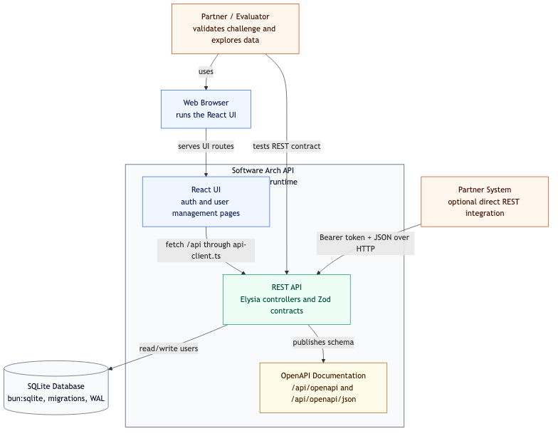

# Diagrama C4 Contexto



- Fonte editavel: [`c4-context.mmd`](c4-context.mmd)
- Export SVG: [`exports/c4-context.svg`](exports/c4-context.svg)
- Export PNG: [`exports/c4-context.png`](exports/c4-context.png)

## 1. Resumo Executivo

Este diagrama mostra o sistema `Software Arch` visto de fora. Ele delimita quem
usa a aplicacao, quais canais entram no sistema, qual contrato e exposto para
integracao e qual dependencia de persistencia sustenta os dominios `User`,
`Product` e `Order`.

A decisao principal e manter UI, API REST, OpenAPI e persistencia local em uma
entrega compacta, com um boundary externo simples: browser para operacao humana
e HTTP JSON com Bearer token para integracao direta.

## 2. Analise Tecnica

### Atores externos

- `Partner / Evaluator`: valida o desafio, navega pela UI e testa o contrato
  REST diretamente.
- `Normal User`: cria e acompanha pedidos.
- `Admin User`: gerencia produtos, usuarios e status de pedidos.
- `Partner System`: representa um consumidor externo opcional da API REST.
- `Web Browser`: executa a UI React e conversa com a API via `/api`.

### Boundary do sistema

O subgrafo `Software Arch` representa um unico runtime Bun. Dentro dele existem
tres superficies relevantes:

- `React UI`: telas de usuarios, produtos, pedidos e dashboards.
- `REST API`: modulos MVC de auth, user, product e order.
- `OpenAPI Documentation`: documentacao publica em `/api/openapi` e contrato
  JSON em `/api/openapi/json`.

O SQLite aparece fora do boundary do runtime porque e a dependencia de estado.
Mesmo rodando localmente no mesmo host, ele deve ser tratado como recurso
externo ao processo HTTP: pode falhar, pode bloquear escrita e precisa de
migrations.

### Fluxo principal

1. Usuario, admin ou avaliador acessa o browser.
2. Browser carrega a UI React servida pelo runtime Bun.
3. A UI chama `/api` usando `src/app/services/api-client.ts`.
4. Sistemas parceiros podem chamar a API diretamente com JSON e Bearer token.
5. A API valida contrato, aplica regras de dominio e persiste em SQLite.
6. O mesmo runtime publica OpenAPI para inspecao do contrato.

### Performance e latencia

O desenho reduz latencia local porque UI e API compartilham processo e nao ha
hop de rede interno entre frontend estatico e backend. O caminho quente de API
continua curto: HTTP, validacao Zod, controller fino, service stateless,
repository com prepared statements e SQLite local.

O custo real esta no I/O do SQLite em rotas de escrita, especialmente criacao e
cancelamento de pedidos, porque elas alteram `orders`, `order_items` e estoque
de `products`.

### Concorrencia e throughput

Services e controllers sao stateless, entao escalam bem dentro do processo Bun.
O limite de throughput nao e o roteador Elysia no escopo do desafio; e o
single-writer do SQLite. Leituras tendem a ser baratas, mas escritas concorrentes
podem disputar lock.

WAL, `busy_timeout`, transacoes curtas e prepared statements mitigam o problema,
mas nao eliminam o limite arquitetural do banco file-backed.

### Falhas e resiliencia

As principais falhas previstas neste nivel sao:

- token ausente, expirado ou invalido;
- payload invalido;
- violacao de regra de dominio;
- indisponibilidade ou lock do SQLite;
- drift entre contrato OpenAPI e implementacao real.

O desenho mitiga esses pontos com JWT no boundary HTTP, schemas Zod, erros de
dominio mapeados no error handler, migrations SQL e OpenAPI gerado a partir das
rotas/schemas.

## 3. Implementacao

Arquivos relacionados:

- Fonte Mermaid: `docs/diagrams/c4-context.mmd`.
- Draw.io editavel: `docs/diagrams/drawio/c4-context.drawio`.
- PNG usado no README: `docs/diagrams/exports/c4-context.png`.
- SVG para zoom: `docs/diagrams/exports/c4-context.svg`.

Comando para regenerar o PNG:

```bash
npx --yes @mermaid-js/mermaid-cli@11.12.0 \
  -i docs/diagrams/c4-context.mmd \
  -o docs/diagrams/exports/c4-context.png
```

Comando para regenerar o SVG:

```bash
npx --yes @mermaid-js/mermaid-cli@11.12.0 \
  -i docs/diagrams/c4-context.mmd \
  -o docs/diagrams/exports/c4-context.svg
```

## 4. Trade-offs

O runtime unico reduz custo operacional e latencia, mas acopla ciclo de release
da UI e da API. Para o desafio isso e positivo porque facilita avaliacao,
execucao local e entrega por binario.

SQLite simplifica persistencia e deixa o SQL auditavel, mas limita escrita
concorrente. O diagrama deixa esse ponto explicito ao separar o banco do runtime
principal.

OpenAPI exposto pelo mesmo processo facilita consumo por parceiros, mas tambem
exige cuidado para nao publicar contratos quebrados ou incompletos.

## 5. Quando usar vs evitar

Use este desenho quando o objetivo for demonstrar uma API REST MVC com UI
operacional, persistencia real e documentacao de contrato em uma entrega simples.
Tambem serve para ferramenta interna, prototipo robusto ou API de parceiro com
baixa concorrencia de escrita.

Evite este desenho quando UI e API precisarem deploy independente, quando varios
processos precisarem escrever no mesmo banco ou quando a organizacao exigir SSO,
auditoria forte, revogacao imediata de sessao e observabilidade distribuida desde
o inicio.

## 6. Escalabilidade

O primeiro passo de escala e manter o boundary externo estavel: `/api` para
contrato HTTP, OpenAPI para descoberta e UI sem acesso direto ao banco. Isso
permite trocar infraestrutura sem redesenhar o dominio.

Evolucao incremental recomendada:

1. Adicionar paginacao e limites maximos nas listas.
2. Medir p50/p95 por rota e tempo de query por repository.
3. Migrar repositories para Postgres se a escrita concorrente crescer.
4. Separar deploy da UI apenas quando ciclo de release independente trouxer valor.
5. Adicionar request id, logs estruturados, metricas e tracing no boundary HTTP.
