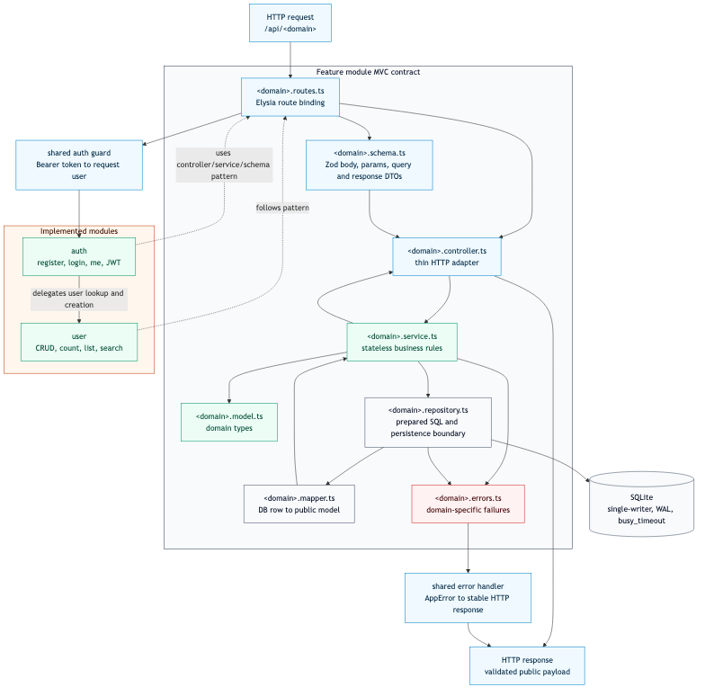

# Diagrama MVC por Modulo



- Fonte editavel: [`mvc-modules.mmd`](mvc-modules.mmd)
- Export SVG: [`exports/mvc-modules.svg`](exports/mvc-modules.svg)
- Export PNG: [`exports/mvc-modules.png`](exports/mvc-modules.png)

## 1. Resumo Executivo

Este diagrama explica o contrato interno de cada feature module da API. O
projeto usa MVC por dominio: cada modulo contem rotas, schemas, controller,
service, repository, mapper, erros e modelos. Isso deixa o padrao arquitetural
visivel no codigo e evita que os dominios fiquem acoplados por pastas tecnicas
globais.

Os modulos implementados sao `auth`, `user`, `product` e `order`.

## 2. Analise Tecnica

### Contrato do modulo

Cada modulo segue o mesmo formato:

- `<domain>.routes.ts`: registra rotas Elysia, schemas, auth guard e handlers.
- `<domain>.schema.ts`: define body, params, query e DTOs publicos com Zod.
- `<domain>.controller.ts`: adapta HTTP para chamadas de service.
- `<domain>.service.ts`: concentra regra de negocio stateless.
- `<domain>.model.ts`: representa tipos internos do dominio.
- `<domain>.repository.ts`: isola SQL, prepared statements e transacoes.
- `<domain>.mapper.ts`: converte row/modelo interno para payload publico.
- `<domain>.errors.ts`: declara falhas especificas do dominio.

Esse contrato e repetitivo de proposito. A repeticao explicita reduz ambiguidade
para avaliacao arquitetural e facilita adicionar dominios sem redesenhar a API.

### Fluxo de request

1. Request entra em `/api/<domain>`.
2. Route aplica schema e, se necessario, auth guard.
3. Controller recebe dados validados e chama service.
4. Service aplica regra de negocio e chama repository.
5. Repository executa SQL preparado contra SQLite.
6. Mapper remove detalhes internos e monta retorno seguro.
7. Controller devolve payload publico validado.
8. Error handler converte falhas conhecidas em HTTP estavel.

### Relacao entre modulos

`auth` usa o modulo `user` para criar e localizar usuarios, mas nao deve expor
`passwordHash` em resposta publica. `order` depende de `product` para validar
estoque e grava itens com snapshot de produto. `user`, `product` e `order`
seguem o mesmo contrato MVC para manter consistencia.

O modulo `order` e o mais sensivel a concorrencia porque cria/cancela pedido e
altera estoque em transacao. O modulo `product` sustenta o catalogo e precisa
manter SKU e quantidade consistentes.

### Performance e latencia

Controller fino reduz trabalho no boundary HTTP. Services stateless evitam
sincronizacao em memoria. Repositories com prepared statements reduzem overhead
de SQL repetido e deixam o caminho quente previsivel.

Mapper explicito evita serializar campos desnecessarios ou sensiveis. Isso
reduz payload e impede vazamento de `passwordHash`.

### Concorrencia e throughput

Como services nao mantem estado, requests concorrentes nao competem por locks em
memoria da aplicacao. A contencao aparece no repository quando o SQLite precisa
serializar escritas.

O fluxo de pedido deve manter transacoes pequenas: validar itens, debitar
estoque, criar `orders` e `order_items`, concluir. Qualquer I/O externo dentro
da transacao aumentaria lock time e reduziria throughput.

### Falhas e resiliencia

Falhas esperadas:

- payload invalido no schema;
- usuario nao autenticado ou sem permissao;
- entidade nao encontrada;
- SKU duplicado;
- estoque insuficiente;
- transicao de pedido invalida;
- falha de persistencia.

O desenho concentra essas falhas em schemas, guards, services, repositories e
error handler, sem espalhar `try/catch` ou regra de HTTP pela aplicacao.

## 3. Implementacao

Arquivos relacionados:

- Fonte Mermaid: `docs/diagrams/mvc-modules.mmd`.
- Draw.io editavel: `docs/diagrams/drawio/mvc-modules.drawio`.
- PNG usado no README: `docs/diagrams/exports/mvc-modules.png`.
- SVG para zoom: `docs/diagrams/exports/mvc-modules.svg`.

Formato esperado para novo dominio:

```txt
src/api/modules/<domain>/
  <domain>.model.ts
  <domain>.schema.ts
  <domain>.repository.ts
  <domain>.service.ts
  <domain>.controller.ts
  <domain>.routes.ts
  <domain>.errors.ts
  <domain>.mapper.ts
```

Comando para regenerar o PNG:

```bash
npx --yes @mermaid-js/mermaid-cli@11.12.0 \
  -i docs/diagrams/mvc-modules.mmd \
  -o docs/diagrams/exports/mvc-modules.png
```

Comando para regenerar o SVG:

```bash
npx --yes @mermaid-js/mermaid-cli@11.12.0 \
  -i docs/diagrams/mvc-modules.mmd \
  -o docs/diagrams/exports/mvc-modules.svg
```

## 4. Trade-offs

MVC por modulo cria mais arquivos do que um CRUD simples em um unico controller.
O ganho e coesao por dominio, menor acoplamento e melhor capacidade de evoluir
persistencia ou regra sem tocar todas as camadas.

Zod como boundary reduz validacao duplicada, mas exige disciplina: novas rotas
precisam declarar schemas completos. Repository isolado melhora testabilidade,
mas tambem exige mappers claros para nao vazar detalhe de banco.

## 5. Quando usar vs evitar

Use este padrao quando o projeto precisa demonstrar MVC real, quando dominios
devem evoluir de forma independente e quando a equipe precisa de um caminho
claro para adicionar features sem espalhar regra por arquivos globais.

Evite quando o dominio e trivial e nao vai crescer, ou quando a aplicacao exige
outro estilo arquitetural ja consolidado pela organizacao. Tambem evite
transformar cada funcao simples em camada nova sem regra de negocio real.

## 6. Escalabilidade

O contrato modular escala por troca de implementacao nos boundaries certos:

1. Trocar SQLite por Postgres no repository sem mudar controller/service.
2. Adicionar paginacao nos schemas e services antes de otimizar infraestrutura.
3. Introduzir indices ou FTS conforme medicao de query.
4. Adicionar metricas por service/repository para achar gargalos reais.
5. Evoluir auth para RBAC mais granular sem reescrever modulos de dominio.

O objetivo e preservar estabilidade do contrato publico enquanto infraestrutura
e regras internas evoluem por necessidade medida.
